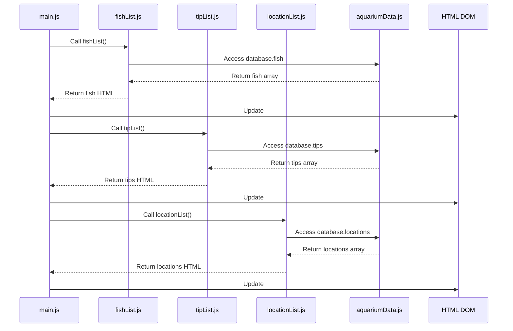

```mermaid
sequenceDiagram
    participant MainJS as main.js
    participant FishListJS as fishList.js
    participant TipListJS as tipList.js
    participant LocationListJS as locationList.js
    participant AquariumData as aquariumData.js
    participant DOM as HTML DOM

    MainJS->>FishListJS: Call fishList()
    FishListJS->>AquariumData: Access database.fish
    AquariumData-->>FishListJS: Return fish array
    FishListJS-->>MainJS: Return fish HTML
    MainJS->>DOM: Update #fishList with fish HTML

    MainJS->>TipListJS: Call tipList()
    TipListJS->>AquariumData: Access database.tips
    AquariumData-->>TipListJS: Return tips array
    TipListJS-->>MainJS: Return tips HTML
    MainJS->>DOM: Update #tipList with tips HTML

    MainJS->>LocationListJS: Call locationList()
    LocationListJS->>AquariumData: Access database.locations
    AquariumData-->>LocationListJS: Return locations array
    LocationListJS-->>MainJS: Return locations HTML
    MainJS->>DOM: Update #locationList with locations HTML
```